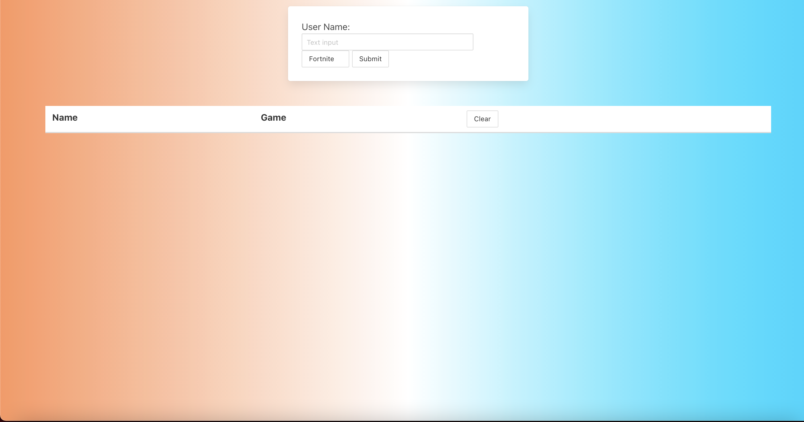

In this assignment my colleagues and I were challenged to create our first project for the class. We decided to create a website that generates stats from two popular shooting video games: Fortnite and Overwatch. When the user types in the name of any gamer's username, the website will display a modal that will consist of their stats which include: wins, losses, deaths, etc. A seperate page was created to compare the stats of two users that were searched. Finding the right APIs and accessing them were one of the challneges that my colleagues and I faced throughout this project. After this project, my colleagues and I have better understanding of the bulma framework as well enhanced our skills with using Javascript and CSS.

[Link to deployed webpage](https://trhines.github.io/loldota/)

## ScreenShot of Portfolio Website

